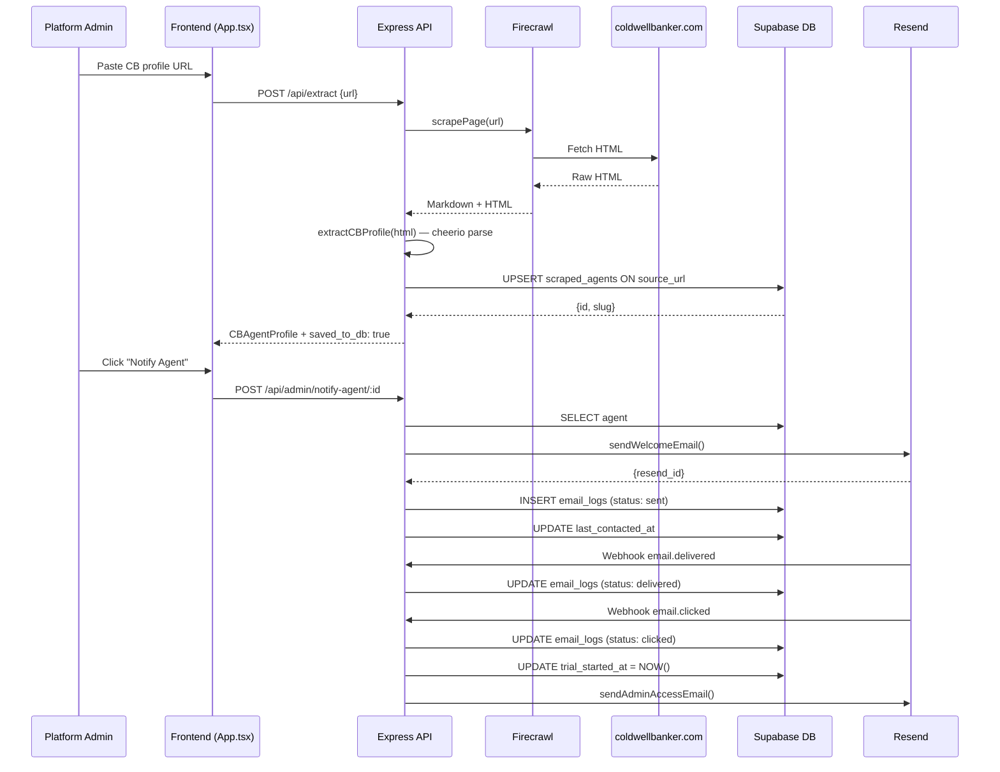

# Data Flow

End-to-end sequence of how data moves through the system from URL input to email delivery.

---

## Full Extraction + Notification Flow

---

## Key Data Transformations

| Step | Input | Output | File |
|------|-------|--------|------|
| Scrape | CB profile URL | Raw HTML | `firecrawl-js` |
| Parse | Raw HTML | `CBAgentProfile` struct | `extractors/coldwellbanker.ts` |
| Save | `CBAgentProfile` | `scraped_agents` row | `services/db.ts:saveProfile` |
| Slug gen | `full_name` | `website_slug` e.g. `john-smith` | `services/db.ts:generateSlug` |
| Email log | Resend API response | `email_logs` row | `services/email.ts` |
| Trial start | `email.clicked` webhook | `trial_started_at = NOW()` | `routes/webhooks.ts` |

---

## Related Notes
- [[Lead-Lifecycle]]
- [[Email-Funnel]]
- [[Extractor-ColdwellBanker]]
- [[Service-Database]]
- [[Route-Webhooks]]
