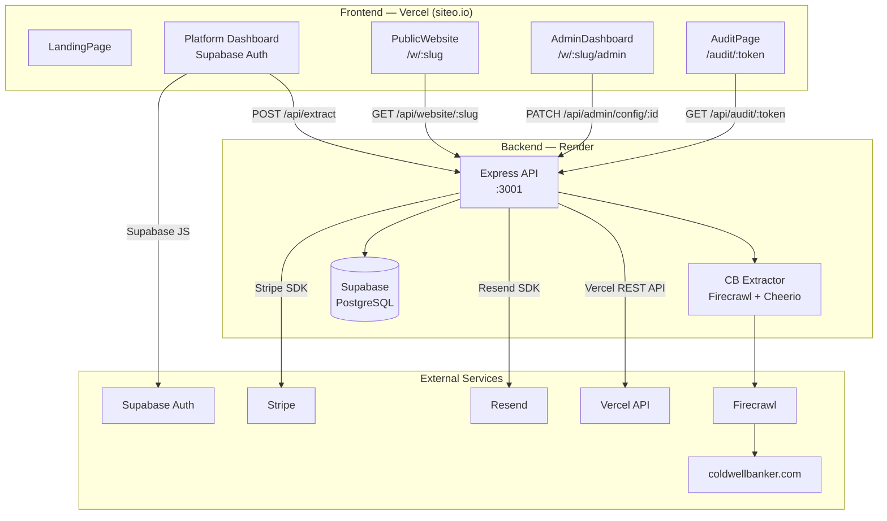

# System Overview

RealEstateLeadAI is a SaaS platform that:
1. Scrapes Coldwell Banker agent profiles (name, email, phone, headshot, bio, socials)
2. Stores them in a CRM dashboard for lead management
3. Auto-generates a personal agent website for each lead at `/w/:slug`
4. Runs an email funnel (welcome → click → trial → upgrade)
5. Bills agents via Stripe subscriptions

---

## Component Architecture

---

## Responsibility Matrix

| Layer | What It Owns |
|-------|-------------|
| Frontend (`web/`) | UI rendering, Supabase auth session, route-level display logic |
| Backend (`scraper-agent/`) | Business logic, scraping, DB writes, email sends, billing |
| Supabase | PostgreSQL storage, auth tokens, file storage (agent-assets bucket) |
| Firecrawl | Headless scraping of CB profile pages |
| Resend | Transactional email delivery + open/click tracking webhooks |
| Stripe | Subscription billing, checkout sessions, billing portal |
| Vercel | Frontend hosting + custom domain mapping per agent |

---

## Three Frontend Personas

The same Vite build serves three completely different experiences based on `DomainRouter.tsx`:

1. **Platform Dashboard** — if `sb-*-auth-token` in `localStorage` → admin CRM tool
2. **Agent Website** — if custom domain maps to a slug → `PublicWebsite`
3. **Landing Page** — default for new visitors → marketing site

---

## Related Notes
- [[Data-Flow]]
- [[Tech-Stack]]
- [[DomainRouter]]
- [[Deployment]]
