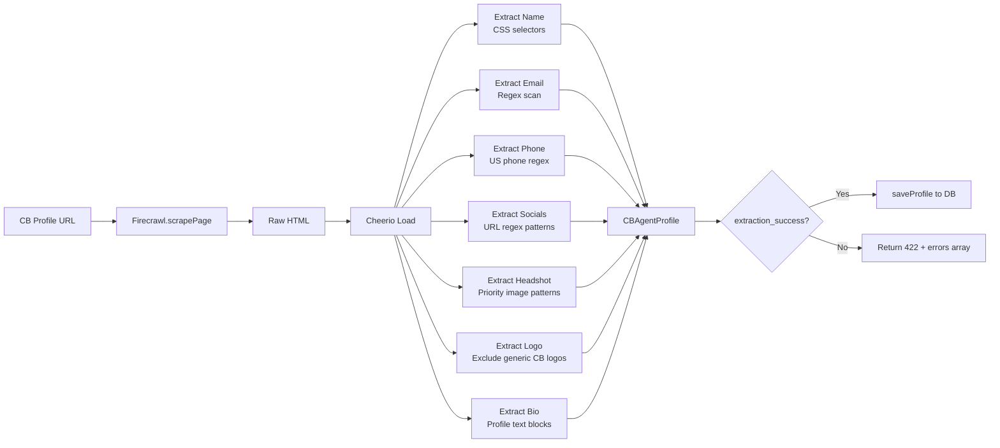

# Extractor: Coldwell Banker

**File**: `scraper-agent/src/extractors/coldwellbanker.ts`

Parses Coldwell Banker agent profile pages into a structured `CBAgentProfile` object.

---

## Extraction Pipeline



---

## `CBAgentProfile` Interface

```typescript
{
    full_name: string
    email: string | null
    mobile_phone: string | null
    office_phone: string | null
    bio: string | null
    headshot_url: string | null
    logo_url: string | null
    brokerage_logo_url: string | null
    office_name: string | null
    office_address: string | null
    license_number: string | null
    profile_url: string
    social_links: {
        linkedin?: string
        facebook?: string
        instagram?: string
        twitter?: string
        youtube?: string
    }
    extraction_success: boolean
    extraction_errors: string[]
}
```

---

## Key Extraction Logic

**Email**: Regex scan across page text — `EMAIL_REGEX` matches `word@word.word` patterns

**Phone**: `PHONE_REGEX` matches US formats — `(XXX) XXX-XXXX`, `XXX-XXX-XXXX`, `XXX.XXX.XXXX`

**Headshot**: Priority-ordered URL matching:
1. URLs containing `/headshots/` or `/agent-photos/`
2. URLs with agent name in path
3. Largest `` with face-related alt text
4. Excludes `OFFICE_PHOTO_PATTERNS` and `GENERIC_CB_LOGOS`

**Slug Generation**:
```typescript
name.toLowerCase().replace(/[^a-z0-9]+/g, '-').replace(/(^-|-$)+/g, '')
// "John Smith Jr." → "john-smith-jr"
```

---

## Related Notes
- [[Route-Leads]]
- [[Service-Database]]
- [[Firecrawl-Scraping]]
