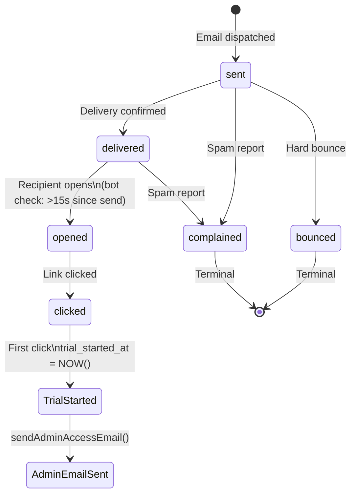

# Route: Webhooks

**File**: `scraper-agent/src/routes/webhooks.ts`

The most complex file in the backend. Handles three distinct webhook endpoints.

---

## 1. Resend Email Webhook — `POST /api/webhooks/resend`

### Verification
Svix verifies the signature using `RESEND_WEBHOOK_SECRET`. Missing headers → 401.

### Email Status State Machine



### Status Hierarchy

```typescript
STATUS_RANK = {
    sent: 0, delivered: 1, delivery_delayed: 1,
    opened: 2, clicked: 3,
    bounced: -1, complained: -1  // terminal — always applies
}
```

Status is **never downgraded** — `clicked` → `opened` is ignored. This prevents out-of-order webhook delivery causing data corruption.

### Bot Detection

`email.opened` events arriving within 15 seconds of send are silently skipped (`reason: 'rapid_open_bot'`).

### Trial Trigger (First Click)

When `email.clicked` fires and `trial_started_at IS NULL` on the lead:
1. Sets `trial_started_at = NOW()`
2. Calls `sendAdminAccessEmail()` with the admin panel URL + default password
3. This logic also runs if the status update is skipped (idempotent side effect check)

---

## 2. Stripe Webhook — `POST /api/webhooks/stripe`

Requires raw body (captured by `server.ts` middleware) for signature verification.

### Events Handled

| Event | Action |
|-------|--------|
| `checkout.session.completed` | Sets `is_paid=true`, stores `stripe_subscription_id` and `stripe_customer_id` |
| `customer.subscription.deleted` | TODO: Set `is_paid=false` |
| `invoice.payment_succeeded` | Sends `sendPaymentSuccessEmail()`. Looks up agent by `stripe_customer_id`, fallback by email |

---

## 3. Inbound Email Forwarder — `POST /api/webhooks/resend/inbound`

Forwards emails sent to `hello@siteo.io` to `siteoteam@gmail.com`.

### Safety Checks (Loop Prevention)

| Check | Blocks |
|-------|--------|
| Sender is `@siteo.io` or `siteoteam@gmail.com` | Self-loop |
| Subject starts with `[Siteo Inbound]` | Recursive forward |
| `To:` doesn't include `hello@siteo.io` | Misrouted email |

On success: forwards with `replyTo: originalSender` so Gmail replies go to the real sender.

Always returns `200` to Resend (even on failure) to prevent retry storms that could spike billing.

---

## Related Notes
- [[Email-Funnel]]
- [[Subscription-Flow]]
- [[Route-Stripe]]
- [[Resend-Email]]
- [[Table-EmailLogs]]
