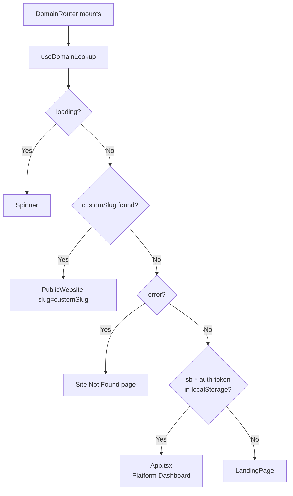

# DomainRouter

**File**: `web/src/DomainRouter.tsx`

The architectural centerpiece of the frontend routing strategy. Determines which experience to render based on the current hostname and auth state.

---

## Decision Logic

---

## `useDomainLookup` Hook

Checks the current `window.location.hostname`. If it's not `siteo.io` or `localhost`, it calls the backend to resolve the hostname to an agent slug.

Supabase project ID is hardcoded in the localStorage key: `sb-jqtrgdmjosegilmbxino-auth-token` — this is the Supabase project reference and is safe to be in client code.

---

## Why This Design

Vercel allows multiple custom domains to point to the same deployment. When an agent connects `janesmith.com`, Vercel routes requests to the React app. `DomainRouter` intercepts before React Router and immediately renders the correct agent website — the visitor never sees `siteo.io/w/jane-smith`.

---

## Related Notes
- [[Frontend-Overview]]
- [[Page-PublicWebsite]]
- [[Vercel-Domains]]
- [[Service-Vercel]]
