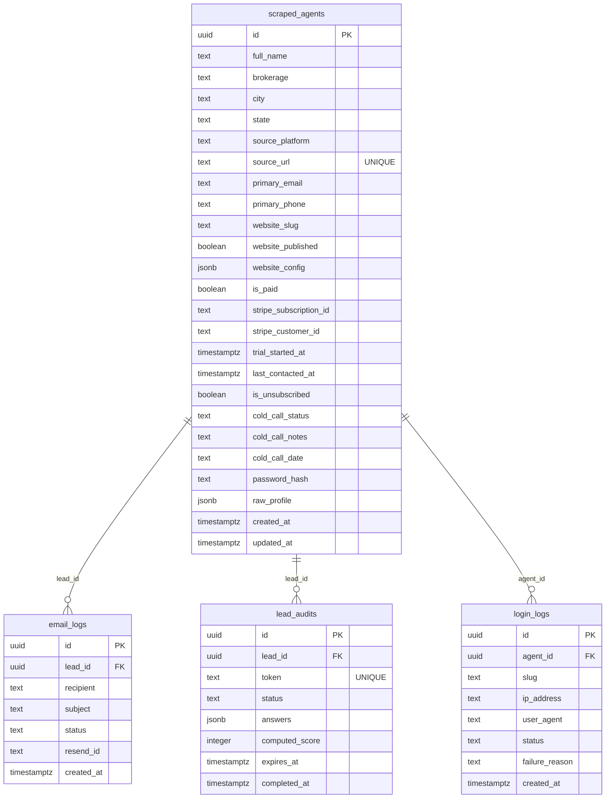

# Database Schema Overview

**Platform**: Supabase (managed PostgreSQL)

---

## Tables

| Table | Purpose |
|-------|---------|
| `scraped_agents` | Core — all lead/agent records |
| `email_logs` | Track every email sent and its delivery status |
| `lead_audits` | Audit funnel records with answers and computed scores |
| `login_logs` | Agent login attempt history |
| `password_reset_tokens` | Time-limited password reset links |
| `feature_flags` | Feature toggles (e.g. `audit_feature_enabled`) |

---

## ERD

---

## Key Design Decisions

1. **UPSERT on `source_url`** — unique index prevents duplicate agents from the same CB profile URL
2. **`raw_profile JSONB`** — stores the full `CBAgentProfile` extraction result; future fields don't require migrations
3. **`website_config JSONB`** — all website customization in one flexible column
4. **Service role** — backend always uses `SUPABASE_SERVICE_KEY` to bypass RLS

---

## Related Notes
- [[Table-ScrapedAgents]]
- [[Table-EmailLogs]]
- [[Table-Audits]]
- [[RLS-Policies]]
