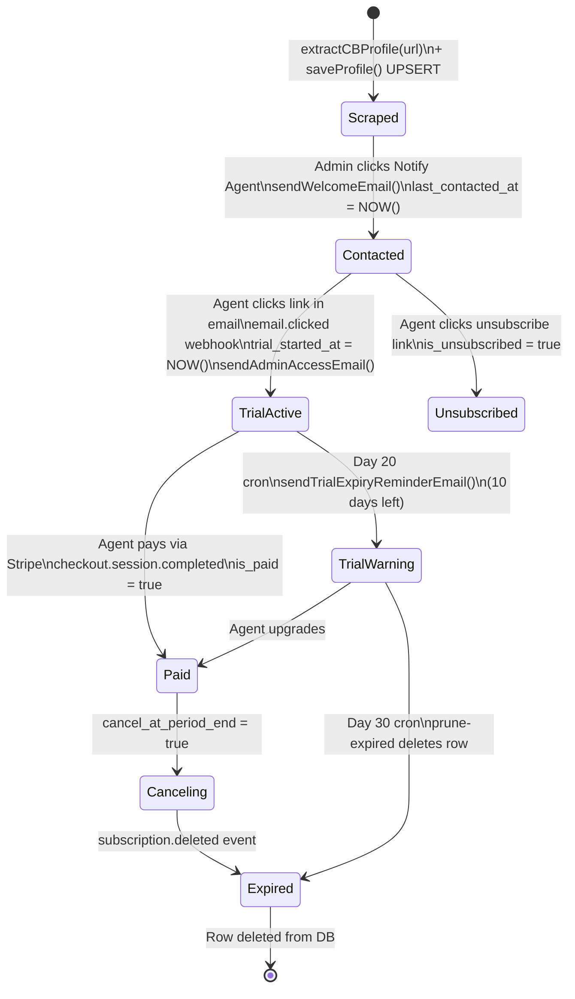

# Workflow: Lead Lifecycle

The full journey of a Coldwell Banker agent through the system.

---

## State Machine

---

## Key Timestamps

| Timestamp | Set When | Used For |
|-----------|----------|----------|
| `created_at` | Row insert | Age of lead |
| `last_contacted_at` | `sendWelcomeEmail()` called | Tracks if emailed, used by batch query |
| `trial_started_at` | First `email.clicked` webhook | Trial start reference |
| `trial_expires_at` | `trial_started_at + 30 days` | Expiry check in cron |
| `last_login_at` | Agent login success | Activity tracking |

---

## Trial Duration

30 days from `trial_started_at`. The 10-day warning fires at day 20 (`trial_started_at + 20 days < NOW() < trial_started_at + 30 days`).

---

## Related Notes
- [[Email-Funnel]]
- [[Subscription-Flow]]
- [[Cron-Jobs]]
- [[Route-Webhooks]]
- [[Table-ScrapedAgents]]
