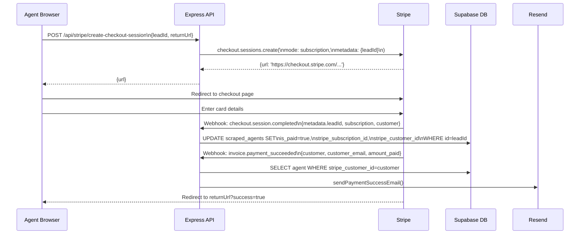

# Workflow: Subscription Flow

Full Stripe billing lifecycle from upgrade click to payment confirmation.

---

## Checkout Sequence

---

## Cancellation Flow

1. Agent clicks **Cancel** in `AdminDashboard`
2. `POST /api/stripe/cancel-subscription { leadId }`
3. Stripe marks subscription `cancel_at_period_end: true`
4. Agent keeps `is_paid = true` until billing period ends
5. On period end: `customer.subscription.deleted` webhook → `is_paid = false` (TODO)

---

## Race Condition Handling

`invoice.payment_succeeded` may arrive before `checkout.session.completed` sets the `stripe_customer_id`. Backend falls back to lookup by `primary_email = invoice.customer_email` and then updates the missing `stripe_customer_id`.

---

## Related Notes
- [[Stripe-Integration]]
- [[Route-Stripe]]
- [[Route-Webhooks]]
- [[Lead-Lifecycle]]
